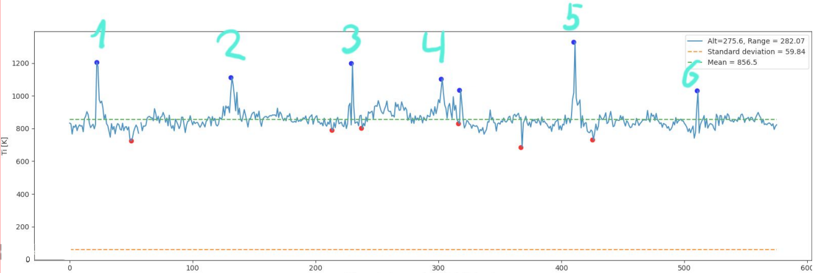
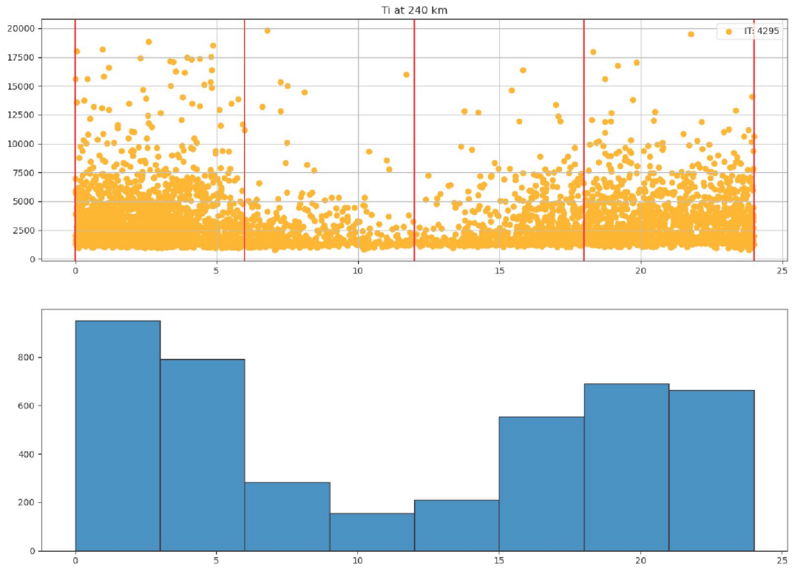
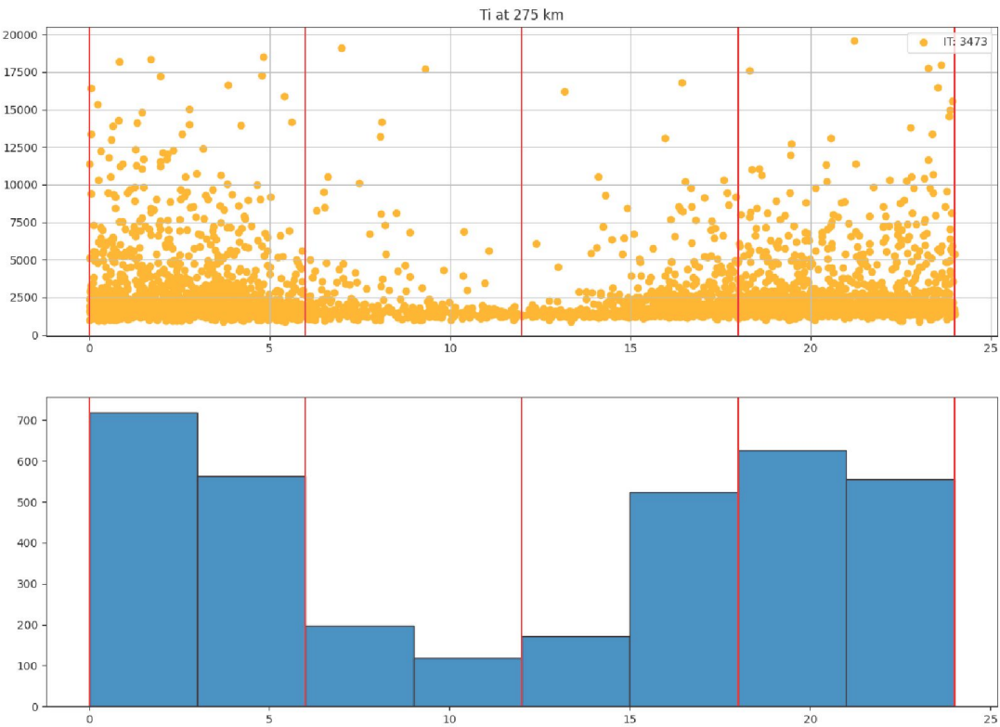
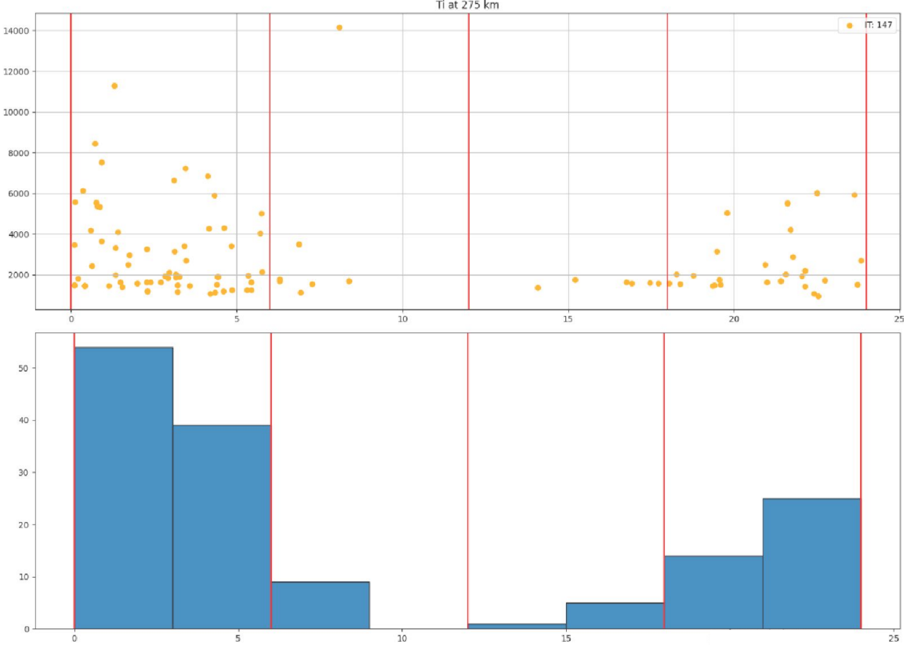
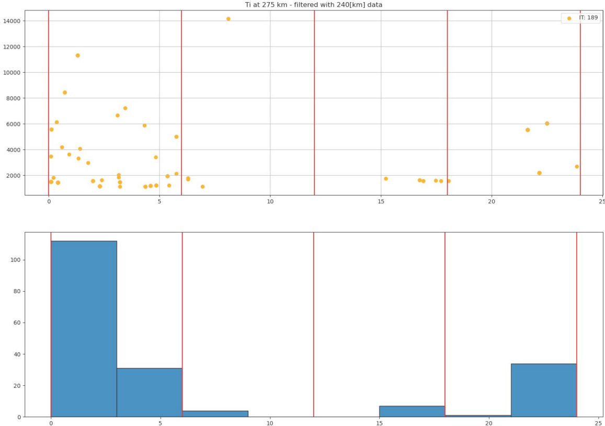

# Strong Thermal Emissions Velocity Enhancements (STEVE)

Author: [Andrew Gyakobo](https://github.com/Gyakobo)

A special thanks to [Dr. Gareth Perry](https://www.linkedin.com/in/gareth-perry-3685013a/) and [Dr. Lindsay Goodwin](https://www.linkedin.com/in/lindsay-v-goodwin/) as they fully guided me through this research.

Moreover, a special shoutout to my colleague [Harsh Panwar](https://www.linkedin.com/in/hpanwar/) for also helping and supporting me through this project.

## Description

This project was done in association with the Solar-Terrestrial Research Department(CSTR) in the New Jersey Institute of Technology (NJIT) and was purposely crafted to find the phenomenon *STEVE*.

>**The Strong Thermal Emission Velocity Enhancement** (STEVE) is a type 
of phenomenon that appears as a night-time mauve emission, equatorward of the auroral oval, during strong plasma flows. They extend thousands of kilometers in the east-west direction and only tens of kilometers in the north-south direction.

Just a few notes about the event:
* PFISR observations near a STEVE event show an ion temperature enhancement parallel to the magnetic field.
* This is consistent with our understanding of STEVE events and their relationship to SAIDs, as well as the time-scales behind ion-neutral frictional heating [Goodwin et al, 2014].

## Methodology

To find an ion temperature enhancement, our algorithm searches for points that are bigger in ¨alue when compared to the preceding and subsequent points. It then filters out enhancements that are not larger than the collective standard deviation multiplied by a factor of 3.5.

>[!NOTE]
>Above is an example of "ion temperature enhancements" on an arbitrary dataset.

To filter out possible enhancements due to noise, enhancements must be observed at both 240 and 275 km altitude. These enhancements are then filtered by looking for the presence of “STEVE-like” structures in Swarm spacecraft data (see poster MDIT-3). This algorithm is applied to PFISR ion temperature data spanning between the years of 2014-2016.

>[!NOTE]
>Above is the Magnetic Local Time(MLT) graph of Ion temperature enhancements at the altitude of 240 km.

>[!NOTE]
>Above is the MLT graph of Ion temperature enhancements at the altitude of 275 km.

## Results

>[!NOTE]
>Above is an MLT graph on ion temperature enhancements at the altitudeof 275 km filtered out by SWARM electron spikes sourced from my colleague [Harsh Panwar](https://github.com/Harsh-Panwar000). 

>[!NOTE]
>Above is the same MLT graph of ion temperature enhancements at both 240 km and 275 km altitudes, further filtered by Swarm spacecraft observations of "STEVE-like" plasma parameters.

## Summary

In this work, an algorithm to find ion temperature enhancements in ISR data has been developed and coupled with Swarm data to search for STEVE events.

Preliminary results show that the occurrence of ion temperature spikes and STEVE plasma conditions are most common at night. Howe¨er, they are most typically post-midnight, which is inconsistent with our current understanding of STEVE optical emissions.

## Relevant publications
The following project was also utilized in preparation for the CEDAR workshop in 2023 in San Diego, CA. and help form my [poster](https://github.com/Gyakobo/STEVE/blob/main/assets/poster.pdf) as well as contributed to [Harsh Panwar's](https://github.com/Harsh-Panwar000) [publication](https://cedarscience.org/sites/default/files/2023-posters/MDIT-3-panwar-harshit-algorithmic-identification.pdf). 

## Reference
* Archer, W. E., Gallardo Lacourt, B., Perry, G. W., St. Maurice, J. P., Buchert, S. C., & Donovan, E. (2019). Steve: The optical signature of intense subauroral ion drifts. Geophysical Research +etters, 46(12), 6279 6286.

* Gallardo Lacourt, B., Nishimura, Y., Donovan, E., Gillies, D. M., Perry, G. W., Archer, W. E., ... & Spanswick, E. L. (2018). A statistical analysis of STEVE. Journal of Geophysical Research: Space Physics, 123(11), 9893 9905.

* Goodwin, L., St.-Maurice, J. P., Richards, P., Nicolls, M., & Hairston, M. (2014). F region dusk ion temperature spikes at the equatorward edge of the high latitude convection pattern. Geophysical Research Letters, 41(2), 300-307.

## Acknowledgement
This research is funded by the NSF - GEM (Award Number 2225972). PFISR observations are sourced from SRI International [website](https://amisr.com/amisr/)
