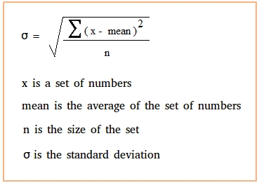

# Methods of finding "abrupt peaks"
Well first of all it's it's very easy to define a peak, however, which peak to consider a "peak" is a very thought-provoking question.

What is this significant line(threshold) that we need to abide by in our selective decision.   

1. We can generally go by standard deviation 
  

1.

Data can be pulled out of this site http://cedar.openmadrigal.org/downloadAdvancedScript
Remote data access http://cedar.openmadrigal.org/docs/name/rt_contents.html
A ray of hope: http://cedar.openmadrigal.org/madrigalDownload

GlobalDownload - Downloads files as is 

## Note: Other interesting methods
# Detecting abrupt changes in a graph 
So there were a couple of methods to use when finding quick and abrupt spikes. I've so far uncovered the aforementioned "Change Point Detection"(Not a well-known algorithm, but works fine) and the "Peak Signal Detection in realtime timeseries data", and so on.

Change point detection (or CPD) detects abrupt shifts in time series trends (i.e. shifts in a time series instantaneous velocity), that can be easily identified via the human eye, but are harder to pinpoint using traditional statistical approaches. CPD is applicable across an array of industries, including finance, manufacturing quality control, energy, medical diagnostics, and human activity analysis.

CPD is great for the following use cases:
1. Detecting anomalous sequences/states in a time series
1. Detecting the average velocity of unique states in a time series
1. Detecting a sudden change in a time series state in real time

Checkout how an AAD is manufactured 

